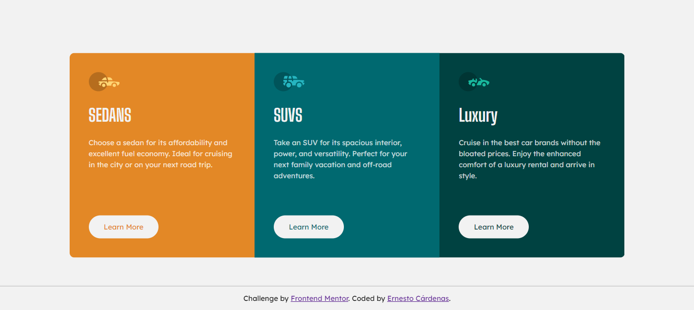

# Frontend Mentor - 3-column preview card component solution

This is a solution to the [3-column preview card component challenge on Frontend Mentor](https://www.frontendmentor.io/challenges/3column-preview-card-component-pH92eAR2-). Frontend Mentor challenges help you improve your coding skills by building realistic projects. 

## Table of contents

- [Overview](#overview)
  - [The challenge](#the-challenge)
  - [Screenshot](#screenshot)
  - [Links](#links)
- [My process](#my-process)
  - [Built with](#built-with)
  - [What I learned](#what-i-learned)
  - [Continued development](#continued-development)
  - [Useful resources](#useful-resources)
- [Author](#author)


## Overview

### The challenge

Users should be able to:

- View the optimal layout depending on their device's screen size
- See hover states for interactive elements

### Screenshot



### Links

- Solution URL: [github.com/ernestoK-2000/3-column-preview-card-component-main](https://github.com/ernestoK-2000/3-column-preview-card-component-main)
- Live Site URL: [3 Column preview Card Component Main](https://ernestok-2000.github.io/src/projects/FrontEnd%20Mentor/3-column-preview-card-component-main/index.html)

## My process

### Built with

- HTML
- CSS
- Flexbox

### What I learned

A card component with multiple sections might seem easy but there are some obstacles as in any project.

When the background section color was changed it seems like the rounded corners from the card component were ignored. What happended was that the outer sections were overflowing the card. So I needed to hide the overflow.

```css
.card-col{
  overflow: hidden;
}
```
Appart of that the rest of the design was pretty straight forward with flexbox and basic CSS animation on hover for the button.

### Continued development

I want to give this challenge another try using React so I can get familiar with that framework. 

### Useful resources

They help me in every project:

- [Stack overflow](https://stackoverflow.com/) - For specific problems and questions.
- [W3Shools](https://www.w3schools.com/) - Useful documentation, examples and exercises you can try and modify.
- [MDN Web Docs](https://developer.mozilla.org/) - Amazing documentation for web developers

## Author

- Website - [Personal Portfolio](https://ernestok-2000.github.io/)
- Frontend Mentor - [ernestoK-2000](https://www.frontendmentor.io/profile/ernestoK-2000)
- LinkedIn - [Ernesto Cardenas Saltiel](https://www.linkedin.com/in/ernesto-cardenas-saltiel-0135b0214/)